# Настройка GRE и DMVPN туннелей между офисами 
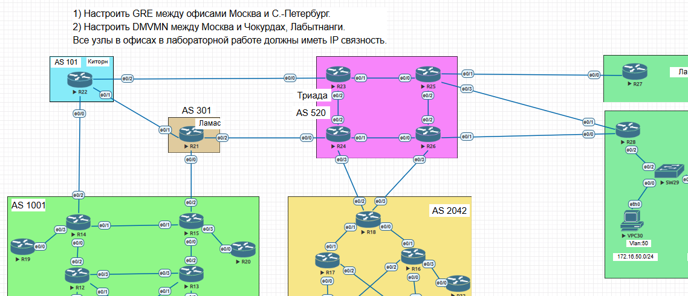

____________________________

# 1. Настройка туннеля GRE между офисом в Москве и Санкт-Петербурге 

## 1.1 Настройка туннеля со стороны Москвы на маршрутизаторе R15

- Настроим тестовую сеть для проверки работоспособности туннеля на интерфейсе Loopback 3

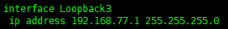

- Создадим интерфейс туннеля, указав все необходимые параметры, источником и адресатом будут интерфейсы Loopback0 

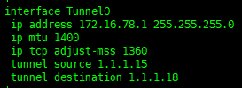

- Укажем статический путь для сети в Санкт-Петербурге внутри туннеля

______________________

## 1.2 Настройка туннеля со стороны Санкт-Петербурга на маршрутизаторе R18

- Настроим тестовую сеть для проверки работоспособности туннеля на интерфейсе Loopback 3 

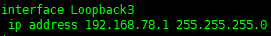

- Создадим интерфейс туннеля, указав все необходимые параметры, источником и адресатом будут интерфейсы Loopback0

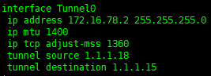

- Укажем статический путь для сети в Москве внутри туннеля

_______________________________

## 1.3 Проверка работоспособности туннеля GRE

- Проверим доступность самого туннеля со стороны Москвы

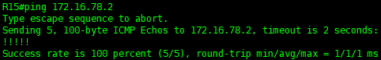

- Проверим доступность московской сети со стороны Санкт-Петербурга

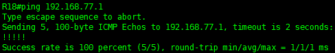

_____________________________________

# 2. Настройка DMVMN между Москвой и Чокурдах, Лабытнанги. Для туннеля возьмем сеть 10.10.177.0 /24

## 2.1 Настройка DMVPN в Москве

- Настроим тестовую сеть на интерфейсе Loopback2

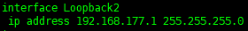

-  Внутри туннеля настроим динамическую маршрутизацию с помощью EIGRP

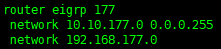

- Настроим DMVPN на R14 в качестве HUB

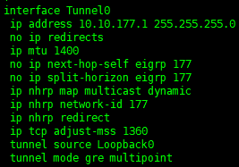
_____________________________

## 2.2 Настройка DMVPN в Чокурдах

 - Настроим тестовую сеть на интерфейсе Loopback2

 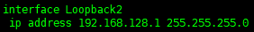

 -  Внутри туннеля настроим динамическую маршрутизацию с помощью EIGRP

 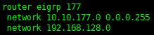

- Настроим DMVPN на R28 в качестве SPOKE

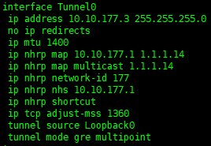
_______________________

## 2.3 Настройка DMVPN в Лабытнанги

- Настроим тестовую сеть на интерфейсе Loopback1

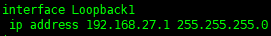

-  Внутри туннеля настроим динамическую маршрутизацию с помощью EIGRP

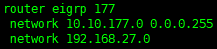

- Настроим DMVPN на R27 в качестве SPOKE

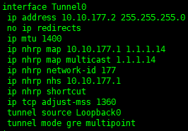

___________________________________

## 2.4 Проверка работоспособности DMVPN

- Проверим EIGRP соседей  из офиса в Москве

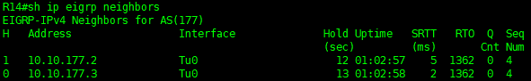

- Проверим маршруты внутри туннеля со стороны Чокурдах

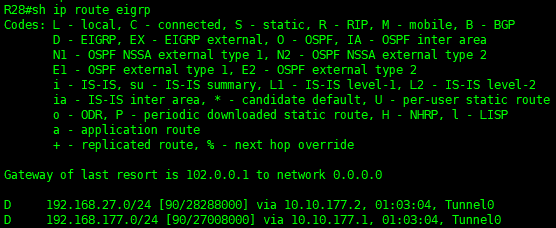

- Проверим доступность сетей Москвы и Чокурдах из Лабытнанги

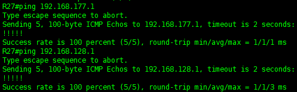

