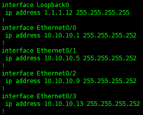
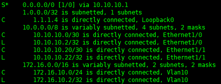
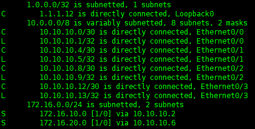
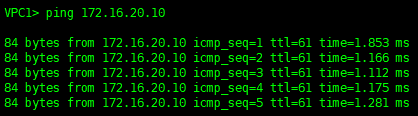
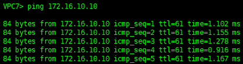

# Проектирование сети
1. Разработать и задокументировать адресное пространство для лабораторного стенда.
2. Настроить ip адреса на каждом активном порту
3. Настроить каждый VPC в каждом офисе в своем VLAN.
4. Настроить VLAN/Loopbackup interface управления для сетевых устройств
5. Настроить сети офисов так, чтобы не возникало broadcast штормов, а использование линков было максимально оптимизировано

# Решение 
Задокументируем адресное пространство для лабораторного стенда:

Москва

| Device| Int | IP |   Descr   | 
|:-------------:|:--:|:-------------:|:--------------------:|
VPC1 |eth 0| 172.16.10.10/24 | Vlan 10 | 
VPC7 |eth 0| 172.16.20.10/24 | Vlan 20 |
SW2 |Lo0 |1.1.1.2|
SW3 |Lo0|1.1.1.3|
SW4|e1/0|10.10.10.2/30|R12
||e1/1|10.10.10.22/30|R13
||Vlanif10|172.16.10.2/24|Vlan 10
||Vlanif20| 172.16.20.2/24 | Vlan 20
||Lo0|1.1.1.4
SW5|e1/0|10.10.10.18/30|R13
||e1/1|10.10.10.6/30|R12
||Vlanif10|172.16.10.3/24|Vlan 10
||Vlanif20| 172.16.20.3/24 | Vlan 20
||Lo0| 1.1.1.5
R12|e0/0|10.10.10.1/30 |SW4
| |e0/1|10.10.10.5/30|SW5
||e0/2|10.10.10.9/30|R14  
||e0/3|10.10.10.13/30|R15
||Lo0|1.1.1.12
R13|e0/0|10.10.10.17/30|SW5
||e0/1|10.10.10.21/30|SW4
||e0/2|10.10.10.25/30|R15
||e0/3|10.10.10.29/30|R14
||Lo0|1.1.1.13
R14|e0/0|10.10.10.10/30|R12
||e0/1|10.10.10.30/30|R13
||e0/2| 100.0.0.2/30|R22 Kitorn
||e0/3|10.10.10.33/30|R19
||Lo0|1.1.1.14
R15|e0/0|10.10.10.26/30|R13
||e0/1|10.10.10.14/30|R12
||e0/2|200.0.0.2/30|R21 Lamas
||e0/3|10.10.10.37/30|R20
||Lo0|1.1.1.15
R19|e0/0|10.10.10.34/30|R14
||Lo0|1.1.1.19
R20|e0/0|10.10.10.38/30|R15
||Lo0| 1.1.1.20
--------------------------------------
Санкт-Петербург 
| Device| Int | IP |   Descr   | 
|:-------------:|:------:|:-------------:|:--------------------:|
VPC8|eth0|172.16.30.10/24|Vlan 30
VPC9|eth0|172.16.40.10/24|Vlan 40
SW9|e0/3|10.10.10.58/30|R17
||e1/0|10.10.10.50/30|R16
||Vlanif30|172.16.30.2/24|Vlan 30
|| Vlanif40|172.16.40.2/24|Vlan 40
||Lo0|1.1.1.9 
SW10|e0/3|10.10.10.42/30|R16
||e1/0|10.10.10.66/30|R17 
||Vlanif30|172.16.30.3/24|Vlan 30
||Vlanif40|172.16.40.3/24|Vlan 40
||Lo0|1.1.1.10
R16|e0/0|10.10.10.41/30|SW10
||e0/1|10.10.10.45/30|R18
||e0/2|10.10.10.49/30|SW9
||e0/3|10.10.10.53/30|R32 
||Lo0|1.1.1.16
R17|e0/0|10.10.10.57/30|SW9
||e0/1|10.10.10.61/30|R18
||e0/2|10.10.10.65/30|SW10
||Lo0|1.1.1.17
R18|e0/0|10.10.10.46/30|R16
||e0/1|10.10.10.62/30|R17
||e0/2|101.0.0.2/30|R24 Triada
||e0/3|201.0.0.2/30|R26 Triada
||Lo0|1.1.1.18
R32|e0/0|10.10.10.54/30|R16
||Lo0|1.1.1.32
---------------------------
Чокурдах
| Device| Int | IP |   Descr   | 
|:-------------:|:------:|:-------------:|:--------------------:|
VPC30|eth0|172.16.50.10/24|Vlan 50
VPC31|eth0|172.16.60.10/24| Vlan 60
SW29|Vlanif50|172.16.50.2/24|Vlan 50
||Vlanif60|172.16.60.2/24|Vlan 60
||e0/2|10.10.10.66/30|R28
||Lo0|1.1.1.29
R28|e0/0|102.0.0.2/30|R26 Triada
||e0/1|202.0.0.2/30|R25 Triada
||e0/2|10.10.10.65/30|SW29
||Lo0|1.1.1.28
------------------
Лабытнанги
| Device| Int | IP |   Descr   | 
|:-------------:|:------:|:-------------:|:--------------------:|
R27|e0/0|103.0.0.2/30|R25 Triada
||Lo0|1.1.1.27
---------------------
Киторн
| Device| Int | IP |   Descr   | 
|:-------------:|:------:|:-------------:|:--------------------:|
R22|e0/0|100.0.0.1/30|R14 Moskva
||e0/1|104.0.0.1/30|R21 Lamas
||e0/2|204.0.0.1/30|R23 Triada
||Lo0|1.1.1.22
----------
Ламас
| Device| Int | IP |   Descr   | 
|:-------------:|:------:|:-------------:|:--------------------:|
R21|e0/0|200.0.0.1/30|R15 Moskva
||e0/1|104.0.0.2/30|R22 Kitorn
||e0/2|105.0.0.1/30|R24 Triada
||Lo0|1.1.1.21
--------------
Триада
| Device| Int | IP |   Descr   | 
|:-------------:|:------:|:-------------:|:--------------------:|
R23|e0/0|204.0.0.2/30|R22 Kitorn
||e0/1|10.10.10.69/30|R25
||e0/2|10.10.10.73/30|R24
||Lo0|1.1.1.23
R24|e0/0|105.0.0.2/30|R21 Lamas
||e0/1|10.10.10.77/30|R26
||e0/2|10.10.10.74/30|R23
||e0/3|101.0.0.1/30|R18 Piter
||Lo0|1.1.1.24
R25|e0/0|10.10.10.70/30|R23
||e0/1|103.0.0.1/30|R27 Labytnangi
||e0/2|10.10.10.81/30|R26
||e0/3|202.0.0.1/30|R28 Chokyrdah
||Lo0|1.1.1.25
R26|e0/0|10.10.10.78/30|R24
||e0/1|102.0.0.1/30|R28 Chokyrdah
||e0/2|10.10.10.82/30|R25
||e0/3|201.0.0.1/30|R18 Piter
||Lo0|1.1.1.26
-------------------------------------------------------
Настройки оборудования сводятся к настройкам ip на требующихся портах, для примера настройки R12

----------------------------------------------------------
Каждый офис настроен в своём Vlan для ограничения широковещательного домена. 
Возьмем для примера офис в Москве:
Переход с L2 на L3 настроен на коммутаторах SW4 и SW5, для примера настройки SW4

-----------------------------------------------------------
Статическая маршрутизация между сетями офисов настроена на R12, для этого на коммутаторах SW4 и SW5 маршрутом по умолчанию укажем соответствующие порты R12, для примера настройки на SW4

Настройки статической маршрутизации на R12

--------------------------------------------
Проверка связности между сетями офисов

