# Настройка DHCP, NAT и NTP

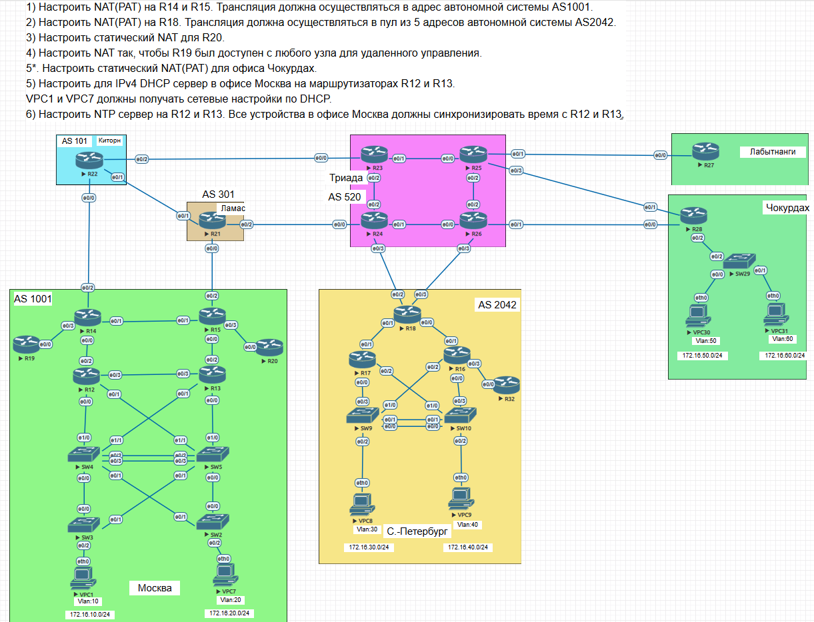

# 1. Настройка NAT (PAT) в Москве на R14 и R15

## 1.1 Настройка NAT (PAT) на R14

- Создаем access-list с разрешенными сетями для трансляций NAT

- Настраиваем параметры для трансляции NAT (PAT)

- Добавляем входные и выходные интерфейсы NAT

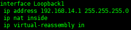 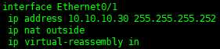

- Проверяем работу NAT (PAT) на R14

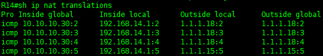

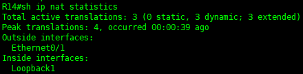

## 1.2 Настройка NAT на R15

- Настроим статический NAT на R15

- Добавляем входные и выходные интерфейсы NAT

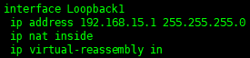 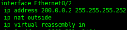

- Проверяем работу NAT на R15

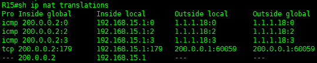

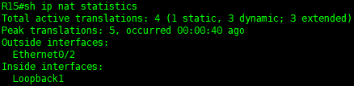

_____________________________________________

# 2. Настройка NAT (PAT) на R18

- Создаем access-list с разрешенными сетями для трансляций NAT

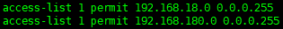

- Создаем пул адресов для трансляции NAT

- Настраиваем динамический NAT

- Добавляем входные и выходные интерфейсы NAT

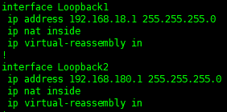 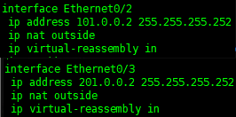

Проверяем работу NAT на R18

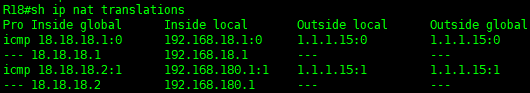

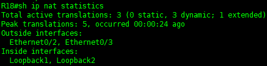

_______________________________________________

# 3. Настройка статического NAT на R20

- Настроим статический NAT на R20

Добавляем входные и выходные интерфейсы NAT

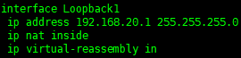 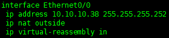

Проверяем работу NAT на R20

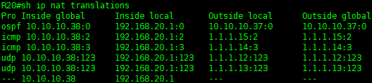

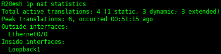

______________________________________

# 4. Настройка NAT на R19, чтобы он был доступен с любого узла сети

- Разрешим доступ по telnet на R19 с других устройств

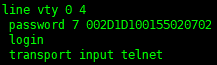

- Настроим NAT с пробросом портов для доступа к R19 с других устройств

- Добавляем входные и выходные интерфейсы NAT

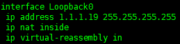 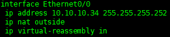

- Проверим доступность R19 по telnet из офиса в Санкт-Петербурге 

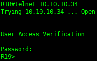

_________________________________________

# 5*. Настройка статического NAT(PAT) в офисе Чокурдах

- Настроим статический NAT на R28

- Добавляем входные и выходные интерфейсы NAT

 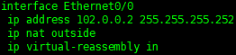

- Проверяем работу NAT на R28

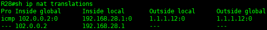

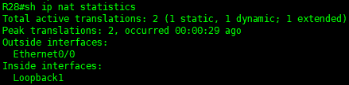

-----------------------------------

# 5. Настройка IPv4 DHCP сервер в офисе Москва на маршрутизаторах R12 и R13

## 5.1 Настройка IPv4 DHCP сервера на R12

- Настраиваем параметры сервера

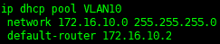

- Исключаем выбранный диапазон адресов из раздачи

- Проверяем, что VPC1 получил настройки через DHCP

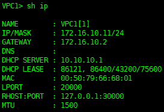

## 5.2 Настройка IPv4 DHCP сервера на R13

- Настраиваем параметры сервера

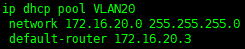

- Исключаем выбранный диапазон адресов из раздачи

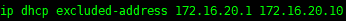

- Проверяем, что VPC7 получил настройки через DHCP

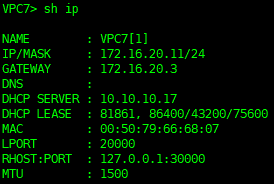

__________________________

# 6. Настройка NTP сервера на R12 и R13, и синхронизации между узлами Московского офиса

## 6.1 Настройка NTP серверов

- Настройка NTP сервера на R12

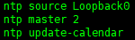

- Настройка NTP сервера на R13

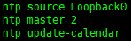

## 6.2 Настройка NTP клиентов на примере R14 и R15

- Настройка NTP клиента на R14

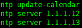

- Настройка NTP клиента на R14

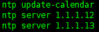

## 6.3 Проверка синхронизации на примере R14 и R15

- Проверка синхронизации на R14

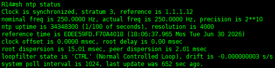

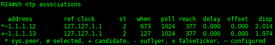

- Проверка синхронизации на R15

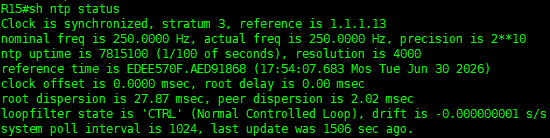

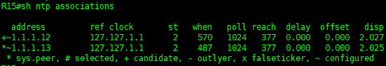

