# Настройка BGP free core в офисах Москвы и Санкт-Петербурга

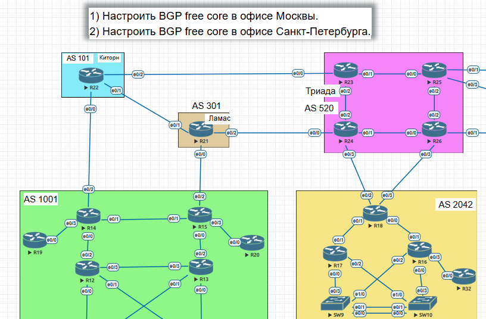
________________________________________

# 1. Настройка BGP free core в офисе Москва 

## 1.1 Для моделирования BGP free core на маршрутизаторах R12, R13, R14  и R15 включим следующие функции:

- ip cef (Cisco Express Forwarding)
- mpls ip - глобально включаем MPLS
- mpls label protocol ldp - включаем протокол ldp для распределения меток
- mpls ldp router-id Loopback0 - задаём идентификатор ldp

## 1.2 Отключаем на промежуточных маршрутизаторах R12 и R13 iBGP

- no router BGP 1001 - отключение iBGP

- Убеждаемся, что на R12 и R13 iBGP отключено (state - idle)

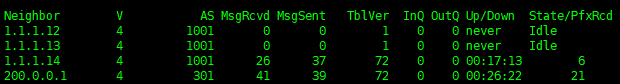 

## 1.3 Смотрим таблицу маршрутизации на R12 и убеждаемся, что в ней нет маршрутов во внешние сети

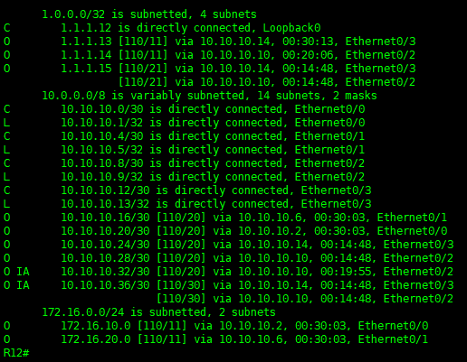

## 1.4 Проверим, есть ли в данный момент связность между R14 и офисом R18 в Санкт-тепербурге

- Временно отключим линк между R14 и 15 и пропингуем R18, убедимся, что связности нет, потому что R12 не знает маршрута до R18

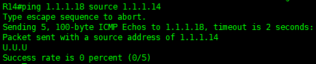

## 1.5 Включение MPLS на ядре в Москве

- Для организации BGP free core в Москве включаем MPLS на всех интерфейсах между R14, R12, R13, R15, для примера:

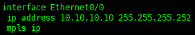

 - Проверяем доступность R18 с R14

 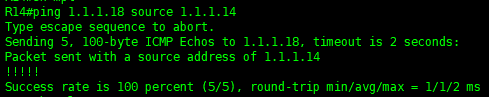

 - Посмотрим маршрут до R18

 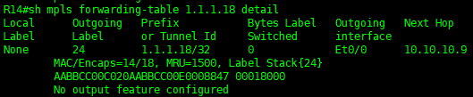

- Включим интерфейс на R14 и проверим изменения маршрута до R18

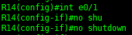

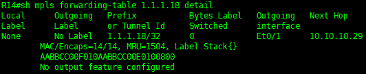

BGP free core в Москве организован.
__________________________________

# 2. Настройка BGP free core в офисе Санкт-Петербург

## 2.1 Настроим в офисе Санкт-Петербурга динамическую маршрутизацию по протоколу OSPF, для примера возьмем R17:

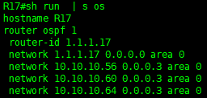

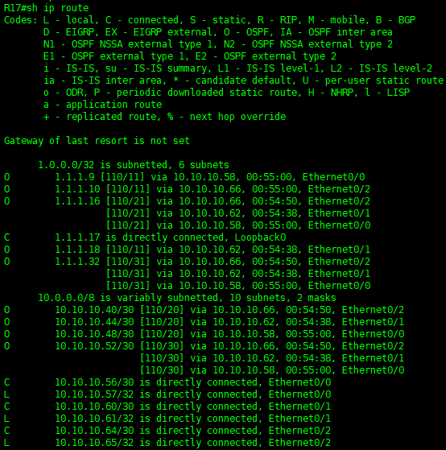

# 2.2 Настраиваем iBGP между R18 и SW9 (анонсируем сеть сотрудников офиса - 172.16.30.0/24)

- Настройки со стороны SW9

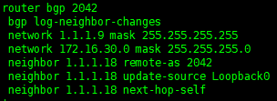

- Попробуем пропинговать Московский офис с VPC8 (172.16.30.1)

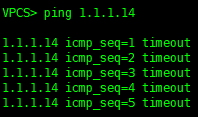

- В данный момент нет связности между маршрутизаторами внутри ядра Питерского офиса. Исправим это, всключив MPLS по протоколу LDP на маршрутизаторах глобально и на конкретных интерфейсах. На примере SW9:

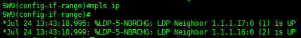

- Посмотрим таблицу переадресации меток 

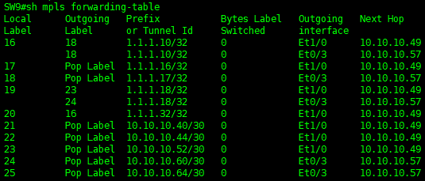

- Проверим связность между филиалами с настроенными DGP free core

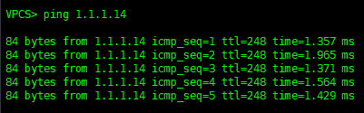

BGP free core в офисе Санкт-Петербург настроен.

