# Настройка GRE и DMVPN поверх IPSec

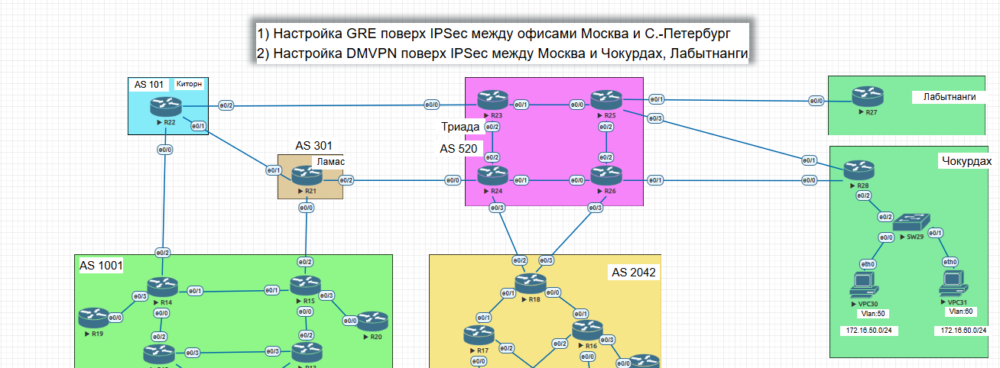

__________________________

# 1. Настройка GRE поверх IPsec with pre shared key между офисами Москва (R15) и Санкт-Петербург (R18)

#1.1 Настройка GRE в Москве и Санкт-Петербурге

- На R15 и R18 создадим GRE туннель, выделим для него подсеть 172.16.78.0/24, в качестве source и destination укажем соответствующие интерфейсы Loopback 

со стороны R15

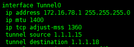

со стороны R18

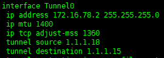

- Выделим подсеть для обмена данными внутри туннеля и статически пропишем маршруты до них

со стороны R15

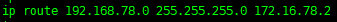

co стороны R18

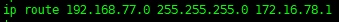

- Проверим доступность туннеля и сетей внутри него

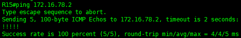

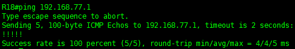
______________________

## 1.2 Настройка IPsec with pre shared key

- Настройка первой фазы

со стороны R15

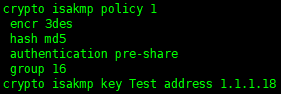

со стороны R18

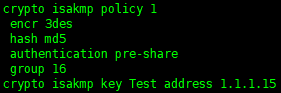

- Настройка второй фазы идентична на обоих маршрутизаторах

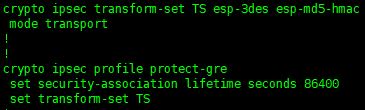

_______________

## 1.3 Настройка GRE поверх IPsec with pre shared key между R15 и R18

- Добавим ipsec  в туннель GRE:

со стороны R15

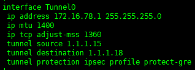

со стороны R18

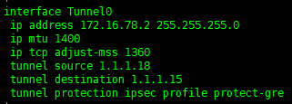

- Проверим работу IPSec

со стороны R15

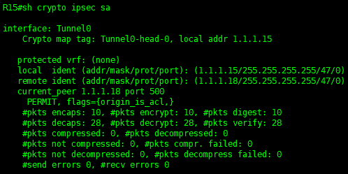

co стороны R18

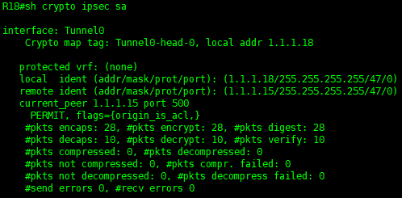

GRE поверх IPsec with pre shared key между офисами Москва (R15) и Санкт-Петербург (R18) настроен.
_______________________________________________________

# 2. Настройка DMVPN поверх IPSec с использованием CA и сертификатов между Москва и Чокурдах, Лабытнанги

## 2.1 Настройка туннеля DMVPN

- Настроим R14 в Москве в качестве HUB

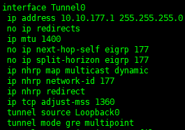

- Настроим R27 b R28 в качестве spoke

в Лабытнанги

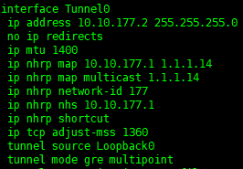

в Чокурдах

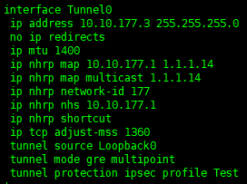

- Выделим подсети для обмена данными между филиалами (в качестве протокола динамической маршрутизации выберем eigrp) и проверим доступность туннеля и сетей

в Москве

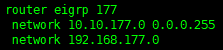

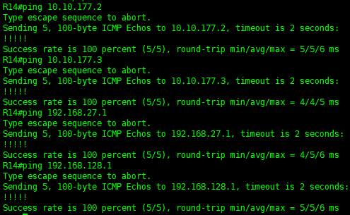

в Лабытнанги

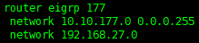

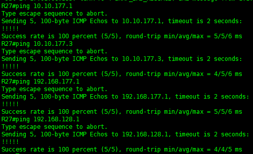

в Чокурдах

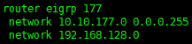

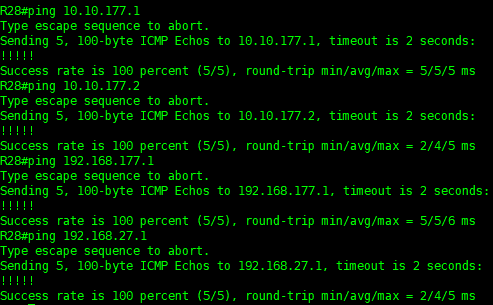

Туннель DMVPN настроен

_____________________________________________

# 2.2 Настройка центра сертификации (CA) и клиентов

- В качестве центра сертификации настроим маршрутизатор R24

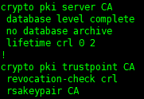

- Настроим R14, R27 и R28 в качестве клиентов, для примера возьмем R14, на остальных маршрутизаторах настройки идентичные

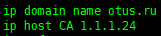

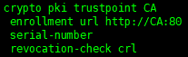

- Запросим в CA сертификаты для клиентов

На примерере R27

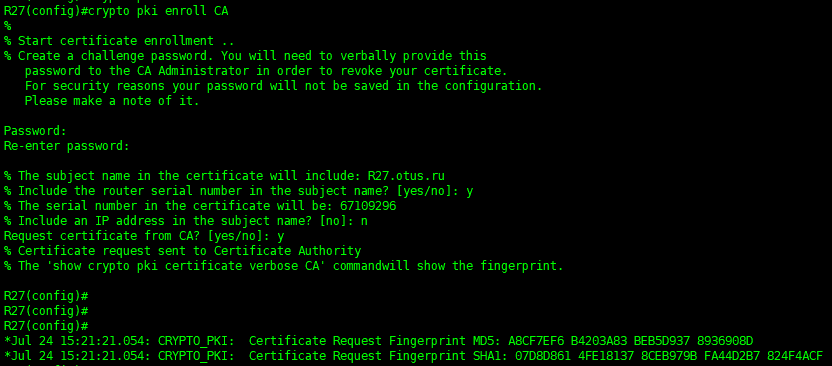

- Со стороны CA подпишем сертификаты для клиентов и посмотрим их 

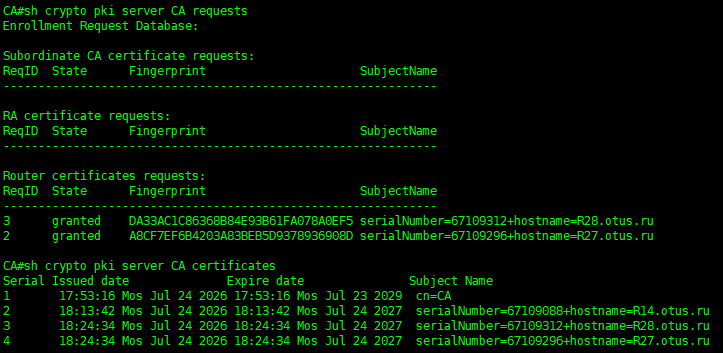
__________________________________

# 2.3 Настройка DMVPN поверх IPSec с использованием CA и сертификатов

- Настроим IPSec на примере R14, на других узлах настройки идентичные

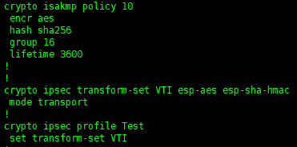

- Добавим IPSec  в туннель и увидим, что туннель развалился

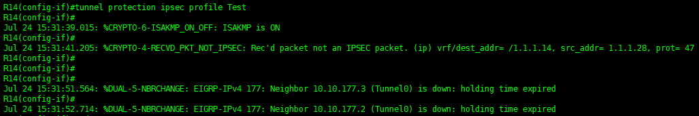

- По мере настройки IPSec на R27 и R28 туннель будет восстанавливаться

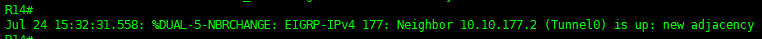

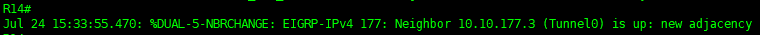

- Проверка Туннеля со стороны R14

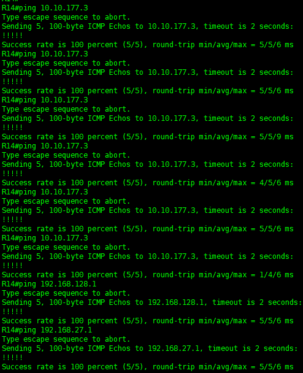

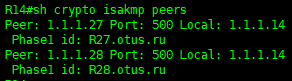

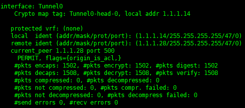

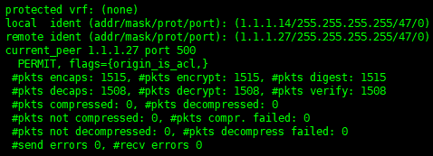

