# Настройка политик маршрутизации и распределение трафика

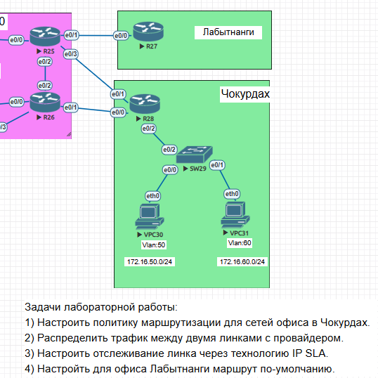

__________________________________

# 1. Настройка политик маршрутизации для сетей офиса в Чокурдах
- SW29 настроен, как коммутатор L2:

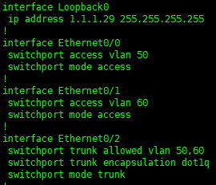

- Переход от L2 к L3 настроен на сабинтерфейсах e0/2.50 и e0/2.60 роутера R28

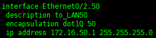 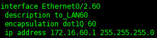

- Проверка связности между сетями офиса

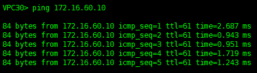

# 2. Распределим трафик каждого офиса на отдельный линк с провайдером на R28

- Создаём access-lists

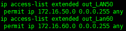

- Создаём route-maps

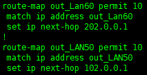

- Прописываем route-maps на входящих интерфейсах

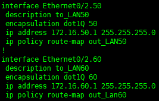

- Проверяем маршруты от офисов до 8.8.8.8

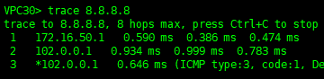 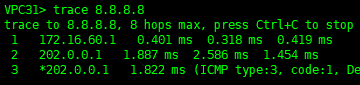

# 3. Настроим отслеживание линка через технологию IP SLA 

- на R28 пропишем два маршрута по умолчанию с разной метрикой

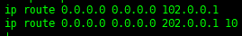

- Настроим ip sla доступности адреса шлюза по умолчанию

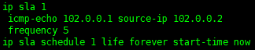

- Настроим отслеживание состояния шлюза

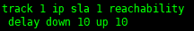
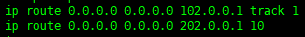

- Проверяем отработку механизма при недоступности и восстановлении маршрута по умолчанию (для провекрки гасим порт e0/1 на R26)

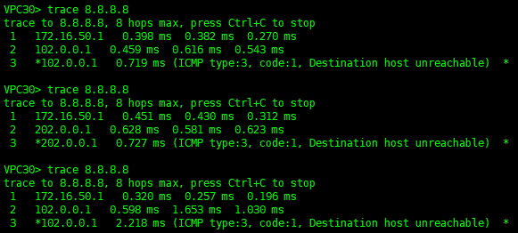

- Настроим механизм отслеживания линка для PBR на примере VPC31, для этого настроим IP SLA  

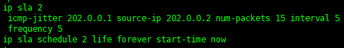

- Настроим отслеживание состояния шлюза

- Добавим проверку в route-map

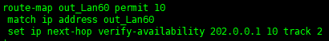

- Проверяем отработку механизма при недоступности и восстановлении шлюза (для проверки гасим порт e0/3 на R25)

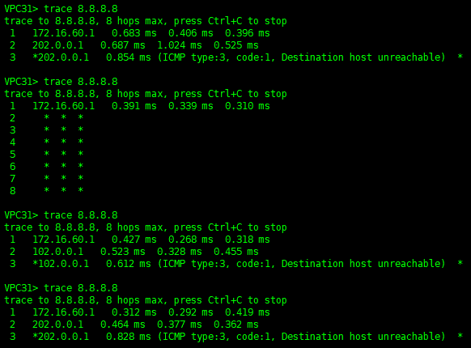

# 4. Настройка маршрута по умолчанию для офиса Лабытнанги

- Для офиса в Лабытнанги настроим полностью заданный маршрут по умолчанию и проверим его

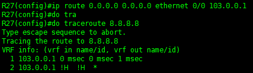

