# Настройка OSPF, разделение сети на зоны, настройка фильтрации между зонами

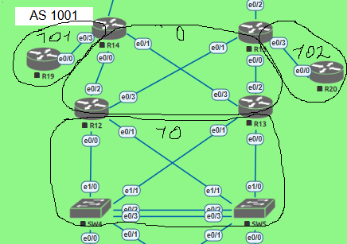

Описание/Пошаговая инструкция выполнения домашнего задания:
1) Маршрутизаторы R14-R15 находятся в зоне 0 - backbone.
2) Маршрутизаторы R12-R13 находятся в зоне 10. Дополнительно к маршрутам должны получать маршрут по умолчанию.
3) Маршрутизатор R19 находится в зоне 101 и получает только маршрут по умолчанию.
4) Маршрутизатор R20 находится в зоне 102 и получает все маршруты, кроме маршрутов до сетей зоны 101.
___________________________________________________

# 1. Настройка зоны backbone

- Расположим интерфейсы маршрутизаторов R14 (e0/0, e0/1), R15 (e0/0, e0/1), R12 (e0/2, e0/3) и R13 (e0/2, e0/3) в зоне 0 

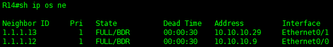
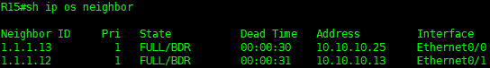
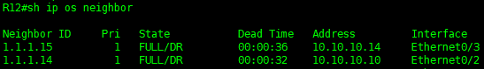
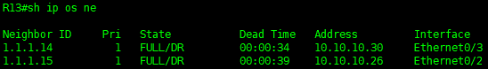
_________________________________________

# 2. Настройка зоны 10

- Расположим интерфейсы маршрутизаторов R12 (e0/0, e0/1), R13 (e0/0, e0/1), SW4 (e0/0, e0/1) и SW5 (e1/0, e1/1) в зоне 10, укажем её, как Stub Area

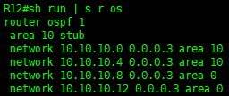 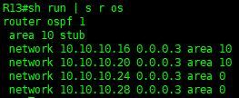

- Маршрутизаторы в этой зоне получат только внутренние маршруты и маршрут по умолчанию до  внешних сетей

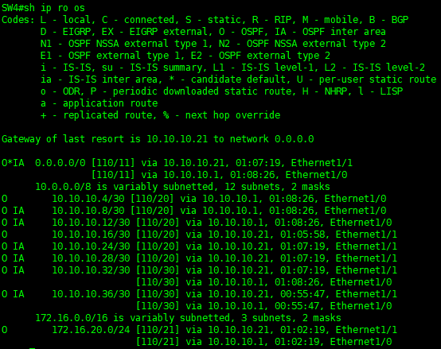 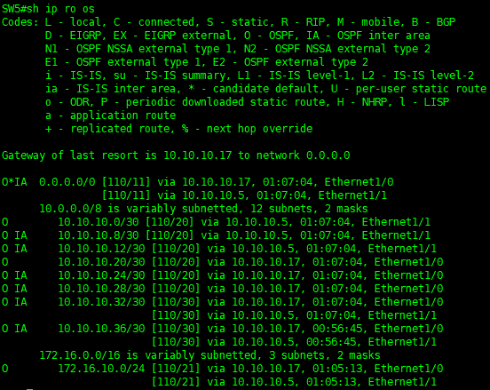
_____________________________________

# 3. Настройка зоны 101

- Расположим интерфейсы маршрутизаторов R14 (e0/3) и R19 (e0/0) в зоне 101, укажем её, как Totally Stub Area

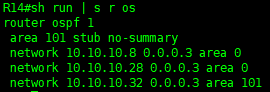

- Маршрутизатор R19 получает только маршрут по умолчанию до всех сетей

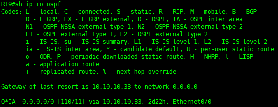
________________________________________

# 4. Настройка зоны 102

- Расположим интерфейсы маршрутизаторов R15 (e0/3) и R20 (e0/0) в зоне 102, укажем её, как Standart Area

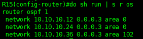

- Удостоверимся, что маршрутизатор R20 получает все маршруты

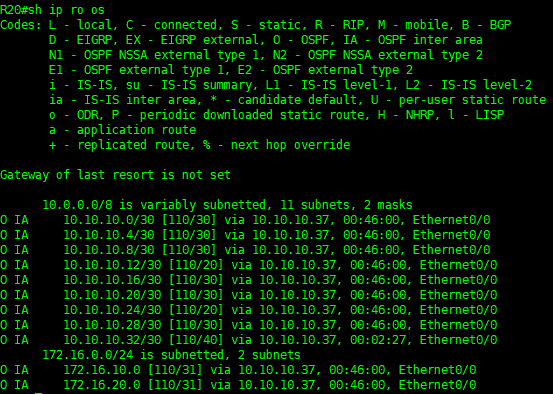

- Для исключения из зоны 102 маршрута до зоны 101 (10.10.10.32/30) на маршрутизаторе R15 создадим Prefix-list с запретом трансляции маршрута до зоны 101

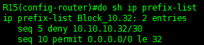

и пропишем его на выход из Backbon area

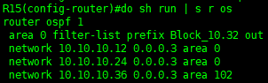

- Удостоверимся, что на маршрутизаторе R20 отсутствует маршрут до зоны 101 (10.10.10.32/30)

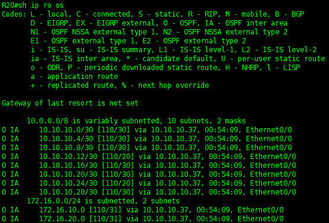
