# Настройка IS-IS в офисе Триада

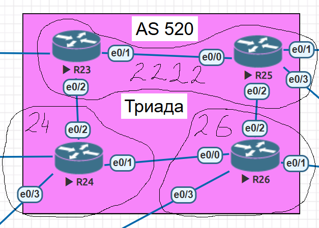
________________________

# 1. Расположим маршрутизаторы R23 и R25 в зоне 2222

- Настраиваем протокол IS-IS на маршрутизаторе R23   

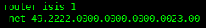    
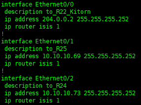

- Настраиваем протокол IS-IS на маршрутизаторе R25

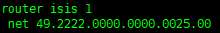  
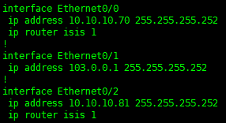

- Проверяем соседство   

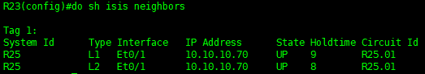
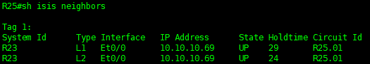
____________________________________________

# 2. Настраиваем протокол IS-IS на маршрутизаторе R24  

- Настраиваем протокол IS-IS в зоне 24

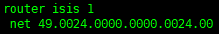   
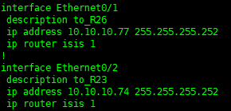

- Проверяем соседство

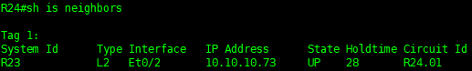
_____________________
# 3. Настраиваем протокол IS-IS на маршрутизаторе R26

- Настраиваем протокол IS-IS на маршрутизаторе R26

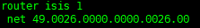  
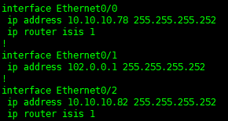

- Проверяем соседство

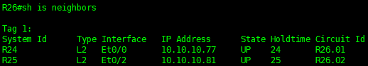 

# 4. Проверка работоспособности системы
- Проверку выполним на R26  
 
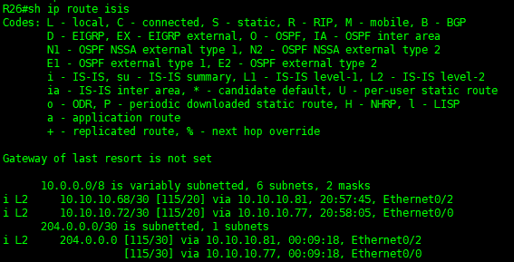
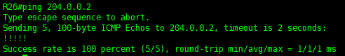   
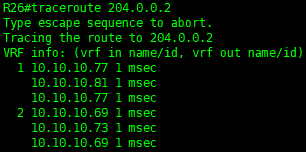