# Настройка протокола EIGRP в офисе Санкт-Петербург

 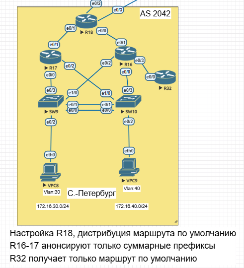

# 1. Настроим протокол EIGRP named mode на маршрутизаторе R 18

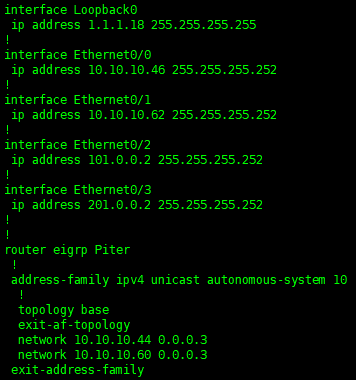

Настроим на маршрутизаторе R18 статический маршрут по умолчанию и добавим его в протокол EIGRP

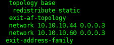

# 2. Настроим протокол EIGRP named mode на маршрутизаторах R16 и R17

- Настройка R17 и суммаризация подсетей

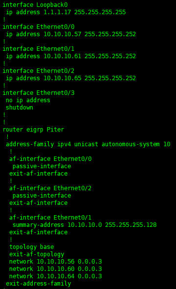

После суммаризации подсетей на R17 на R18 будет следующая записать маршрута 

При этом на самом R17 таблица маршрутизации примет вид

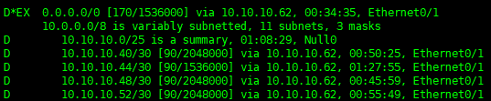

- Настройка R16, суммаризацию сетей проводить не будем, так как возникает пересечение маршрутов с R17 и нарушается связность

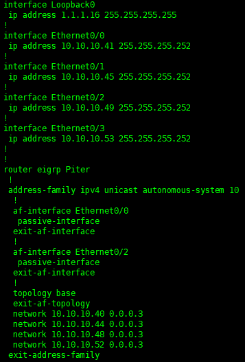

# 3. Настроим протокол EIGRP named mode на маршрутизаторе R 32

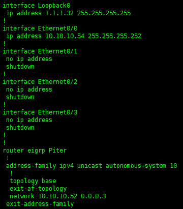

- Таблица маршрутизации R32 на данный момент имеет вид 

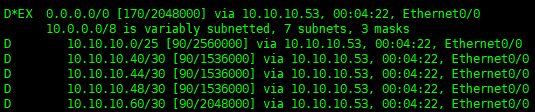

- Для того, чтобы R32 получал только маршрут по умолчанию необходимо создать преффикс-лист и назначить его на соответствующий интерфейс 

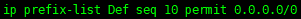

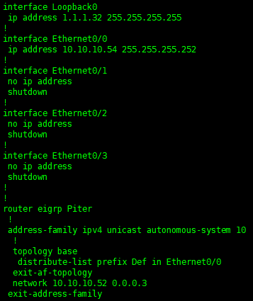

- После этого таблица маршрутизатора R32 примет следующий вид

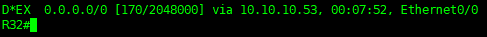

- Для проверки работоспособности системы пропингуем с R32 один из интерфейсов R17

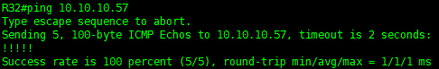
