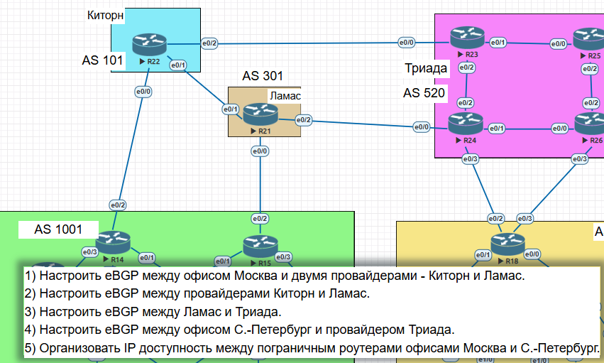
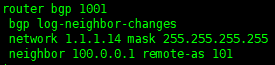
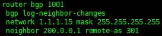
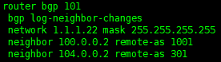
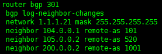
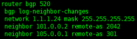
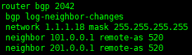
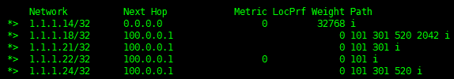
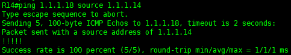
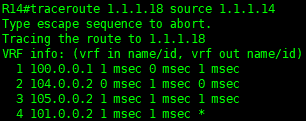

# Настройка BGP между автономными системами

____________________

# 1) Настройка eBGP между офисом Москва и двумя провайдерами - Киторн и Ламас

-  Настройка маршрутизатора R14

- Настройка маршрутизатора R15

------------------------

# 2) Настройка eBGP между провайдерами Киторн и Ламас

- Настройка маршрутизатора R22 в Киторне

- Настройка маршрутизатора R21 в Ламасе

-------------

# 3) Настройка eBGP между Ламас и Триада

- Настройка маршрутизатора R24 в Триаде

------------

# 4) Настройка eBGP между офисом С.-Петербург и провайдером Триада

- Настройка маршрутизатора R18 В Манкт-Петербурге

 

------------------

# 5) Проверка IP доступности между пограничными роутерами офисов в Москве и Санкт-Петербурге

- Проверим доступность Питерсокго маршрутизатора R18 c Москвского маршрутизатора R14

