# Настройка  iBGP в офисах 
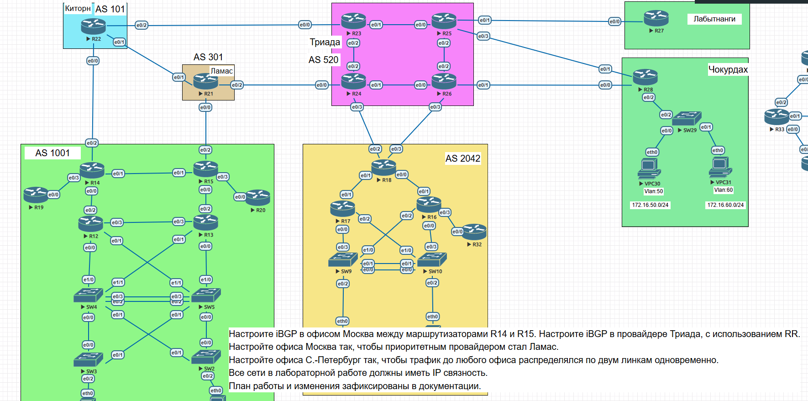

______________________________________

## 1) Настройка iBGP в Москве 

- Настройка IBGP на маршрутизаторе R14

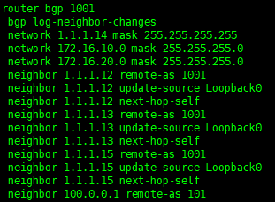

- Настройка IBGP на маршрутизаторе R15

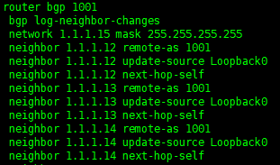

-------------------------

# 2) Настройка iBGP в провайдере Триада с использованием RR

- Настроим R24, как RR

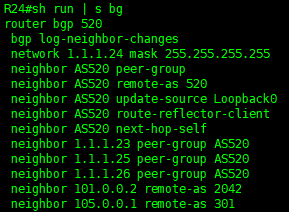

- Настроим остальные маршрутизаторы провайдера, как клиенты, для примера настройки на R23

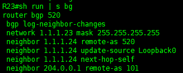

--------------------------

# 3) Настроим офис в Москве так, чтобы приоритетным провайдером стал Ламас

- В исходном состоянии приоритетным провайдером является Киторн, проверим это на маршрутизаторе R12

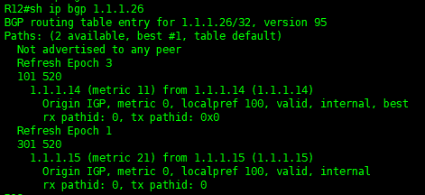
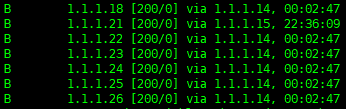

##  Для изменения приоритета IPS выполним следующие действия

- у провайдера Киторн запросим анонс маршрута по умолчанию для нашей сети

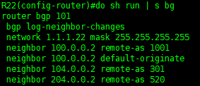

- На маршрутизаторе R14 настроим preffix-list с разрешенным маршрутом по умолчанию и повесим его на провайдера Киторн

- После данных действий приоритет IPS изменится + мы имеем маршрут по умолчанию через Киторн на случай аварии у Ламаса

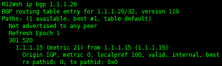

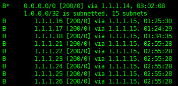

_________________________

# 4) Распределение трафика из Санкт-Петербурга по двум линкам одновременно

- В исходном состоянии мы имеем два идентичных линка c разными  между офисом в Санкт-петербурге и провайдером Триада

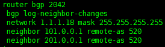

- для распределения трафика по двум линкам одновременно пропишем команду "maximum-paths 2"

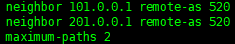

- Проверим доступные маршруты

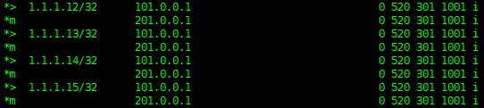

____________

# 5) Проверим связность между офисами с маршрутизатора R12

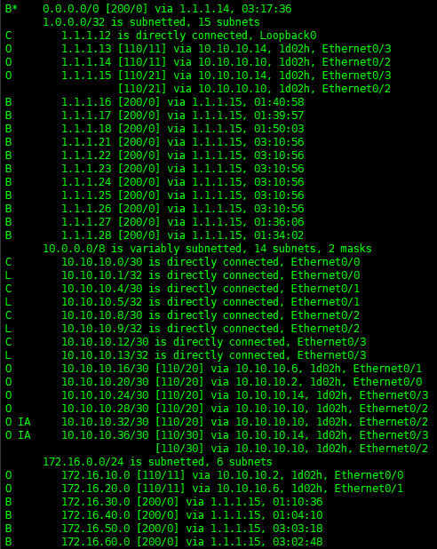

Так же проверим доступность удаленных офисов с компьютера в Москве

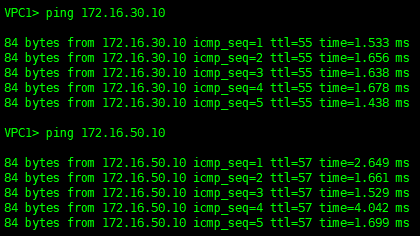

