# Настройка BGP фильтрации

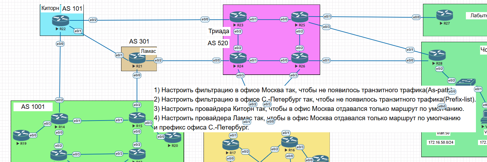
_________
## 1) Настройка фильтрации в офисе Москва так, чтобы не появилось транзитного трафика(As-path)

- Сначала проверим какие маршруты до R24, есть на маршрутизаторе R22. Видим, что один из маршрутов проходит транзитом через AS1001

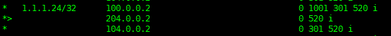

- на R14 создаем ip as-path access-list с разрешением рассылки только локальных маршрутов 

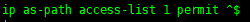 

- Вешаем filter-list c as-path access-list на соседа R22

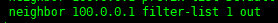

- Проверим какие маршруты до R24 есть на маршрутизаторе R22 и убедимся, что больше нет транзитного маршрута через AS1001

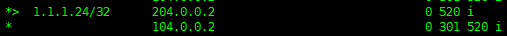

_____________________________

## 2) Настройка фильтрации в офисе Санкт-Петербург так, чтобы не появилось транзитного трафика(Prefix-list)

- Сначала проверим какие маршруты на R24 анонсируются соседом R18

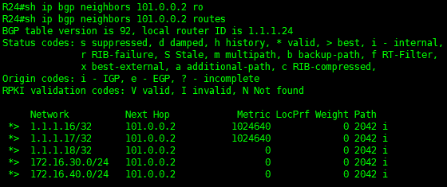

- Для примера настроим фильтрацию маршрутов на R18 с помощью prefix-list, за условие примем анонс только локального маршрута от R18

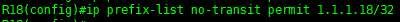

- Вешаем prefix-list на соседа R24

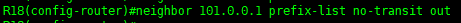

- Проверяем на R24, что фильтрация с помошью prefix-list работает и анонсируется только конкретный локальный маршрут

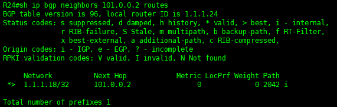

______________________________________

## 3) Настроить провайдера Киторн так, чтобы в офис Москва отдавался только маршрут по умолчанию.

- Проверим какие анонсы получает R14 от R22

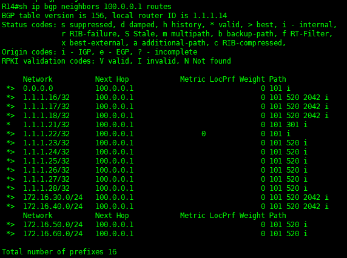

- Настроим на маршрутизаторе R22 prefix-list 

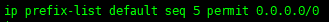

- Повесим его на соседа R14

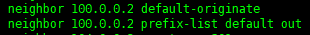

- Проверим какие анонсы получает R14 от R22 теперь

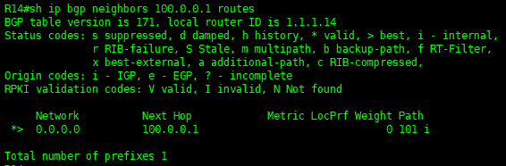

___________________________________________________

## 4) Настроить провайдера Ламас так, чтобы в офис Москва отдавался только маршрут по умолчанию и префикс офиса С.-Петербург.

- Проверим какие анонсы получает R15 от R21

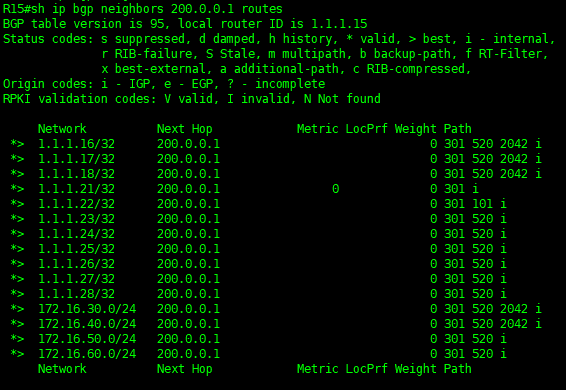

- На R21 создадим prefix-list с разрешенными сетями

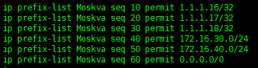

- Добавим его в route-map

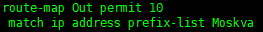

- Повесим route-map на соседа R15

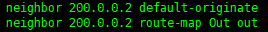

- Проверим какие анонсы получает R15 от R21 после фильтрации

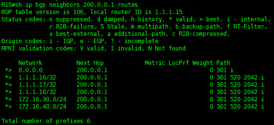