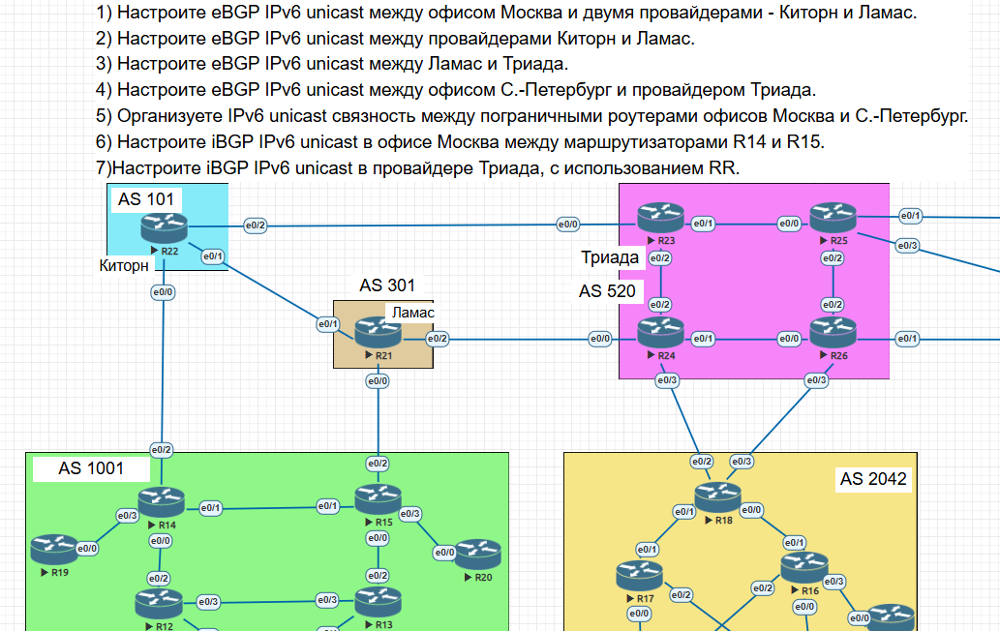
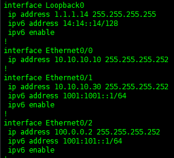
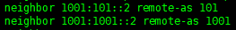
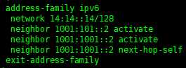
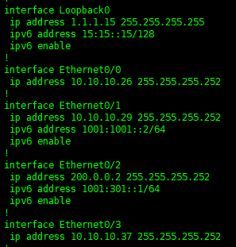
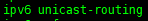
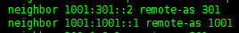
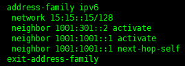

# Настройка eBGP/iBGP IPv6 unicast для всех сегментов сети

____________________________________________

# 1 и 6) Совместим настройку eBGP IPv6 unicast между офисом Москва и двумя провайдерами - Киторн и Ламас с настройкой iBGP IPv6 unicast в офисе Москва между маршрутизаторами R14 и R15

## 1.1  Настройки на R14 в Москве 

- Настройка ipv6 интерфейсов

- Включение ipv6 unicast-routing

- Добавление соседей в в BGP и анонс Loopback

## 1.2 Настройки на R15 в Москве

- Настройка ipv6 интерфейсов

- Включение ipv6 unicast-routing

- Добавление соседей в в BGP и анонс Loopback

## 1.3 Настройки на R22 в Киторне