# Настройка eBGP/iBGP IPv6 unicast для всех сегментов сети

____________________________________________

# 1, 2, 3, 6) Совместим настройку eBGP IPv6 unicast между офисом в Москве и провайдерами, и iBGP IPv6 unicast в офисе Москва между маршрутизаторами R14 и R15

## 1.1  Настройки на R14 в Москве 

- Настройка ipv6 интерфейсов

- Включение ipv6 unicast-routing

- Добавление соседей в BGP и анонс Loopback

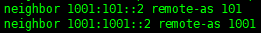

## 1.2 Настройки на R15 в Москве

- Настройка ipv6 интерфейсов

- Включение ipv6 unicast-routing

- Добавление соседей в BGP и анонс Loopback

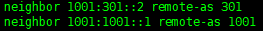

## 1.3 Настройка eBGP IPv6 unicast на R22 в Киторне

- Настройка ipv6 интерфейсов  

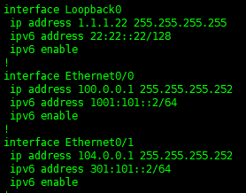

- Включение ipv6 unicast-routing

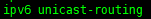

- Добавление соседей в BGP и анонс Loopback

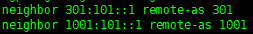

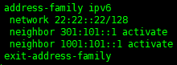

## 1.4 Настройка eBGP IPv6 unicast на R21 в Ламасе

- Настройка ipv6 интерфейсов  

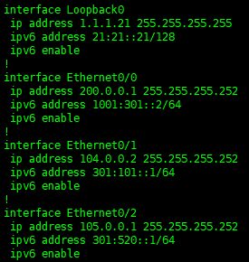

- Включение ipv6 unicast-routing

- Добавление соседей в BGP и анонс Loopback

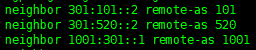

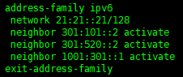

# 4 и 7) Совместим настройку eBGP IPv6 unicast между офисом С.-Петербург и провайдером Триада, и iBGP IPv6 unicast в провайдере Триада с использованием RR

## 4.1 Настройка eBGP IPv6 unicast на R18 в офисе Санкт-петербург

- Настройка ipv6 интерфейсов

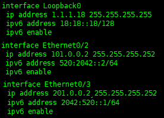

Включение ipv6 unicast-routing

- Добавление соседей в BGP и анонс Loopback

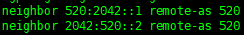

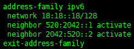

## 4.2 Настройка eBGP IPv6 unicast и iBGP IPv6 unicast с использованием RR на R24 в офисе Триада

- Настройка ipv6 интерфейсов

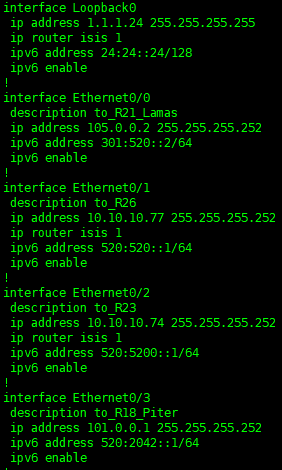

Включение ipv6 unicast-routing

- Добавление соседей в BGP, настройка RR и анонс Loopback

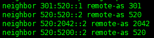

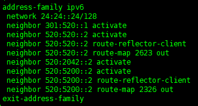

Так же настроим route-map для RR клиентов

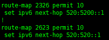

И проверим, что R23 и R26 получают актуальные маршруты

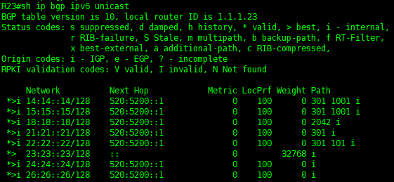

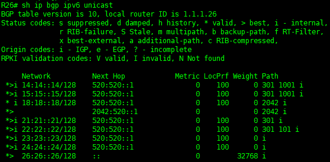

# 5 и 8) Проверка связности между сетями на примере офисов в Москве и Санкт-петербурге

## 5.1 Проверка таблицы маршрутизации на пограничном роутере R15 в Москве

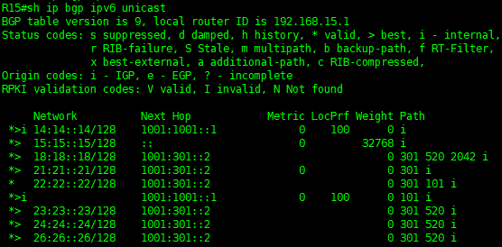

## 5.2 Проверка таблицы маршрутизации на пограничном роутере R18 в Санкт-Петербурге

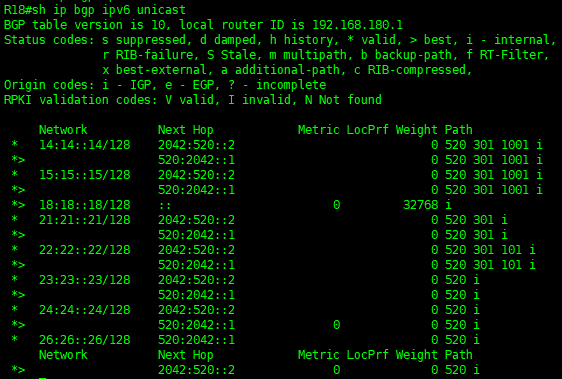

## 5.3 Проверка связности между сетями в Москве и Санкт-Петербурге

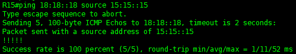

## 5.4 Проверка связности между сетями из офиса в Санкт-Петербурге

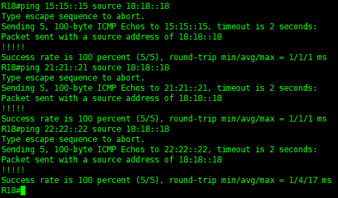

